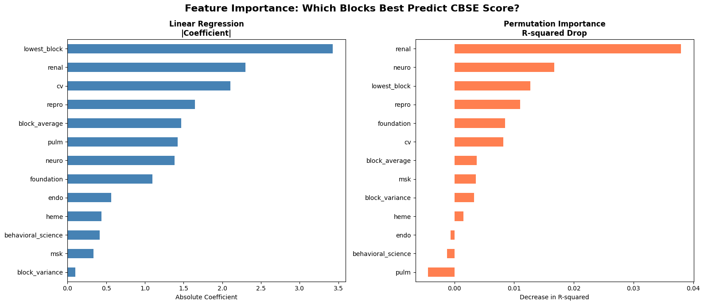

# NBME CBSE Early Warning Tool

A machine learning pipeline that predicts NBME CBSE (Comprehensive Basic Science Examination) scores from organ system block exam performance, identifies the strongest predictive blocks, and flags at-risk students for early intervention.

## Problem

Medical students take organ system block exams (Cardiovascular, Neuroscience, Renal, etc.) throughout their preclinical years. The CBSE serves as a readiness assessment for USMLE Step 1. Students who perform poorly on the CBSE often lack time for effective remediation. **Early identification of at-risk students — before they take the CBSE — enables targeted academic support.**

## Approach

| Step | Method | Output |
|------|--------|--------|
| EDA | Correlation analysis, distribution plots | Heatmap, scatter plots |
| Modeling | Linear Regression, Random Forest, XGBoost | Model comparison (MAE, RMSE, R²) |
| Feature Importance | Coefficients, Permutation Importance, SHAP | Ranked block predictors |
| Early Warning | Threshold-based flagging with risk scores | At-risk student list |

## Key Findings (Synthetic Data)

- **Linear Regression outperformed** Random Forest and XGBoost (CV R² = 0.46 vs 0.44 vs 0.40), demonstrating that simpler models generalize better with limited training data (n=400)
- **Lowest block score** was the strongest single predictor of CBSE performance (coefficient = 3.43), suggesting a "weakest link" effect
- **Renal** and **Cardiovascular** blocks had the highest individual predictive power among organ systems
- XGBoost showed severe overfitting (Train R² = 0.99, Test R² = 0.22), highlighting the importance of model complexity matching data size
- **34% of current cohort** flagged as at-risk (predicted CBSE < 194)

## Feature Importance



## Project Structure

```
├── main.py                     # End-to-end pipeline (one command)
├── src/
│   ├── generate_synthetic_data.py
│   ├── data_loader.py
│   ├── preprocessing.py
│   ├── models.py
│   ├── feature_importance.py
│   └── early_warning.py
├── notebooks/
│   └── 01_data_exploration.ipynb
├── data/raw/                   # Input CSVs
├── output/                     # Generated reports and visualizations
└── docs/learning_notes.md      # ML/DS concepts documented during development
```

## Quick Start

```bash
pip install -r requirements.txt
python main.py
```

This generates synthetic data, trains models, analyzes feature importance, and produces the early warning report — all in one command.

## Data Privacy

This project uses **synthetic data** to demonstrate the methodology. No real student records are included. The pipeline is designed to work with real institutional data when deployed in a secure environment compliant with FERPA regulations.

## Replacing with Real Data

1. Place your CSV files in `data/raw/` (`block_scores.csv` + `cbse_results.csv`)
2. Ensure a `student_id` column exists in both files
3. All numeric columns (except `student_id`, `name`, `cbse_score`) are automatically used as features
4. Run `python main.py`

## Technical Details

- **Models**: Linear Regression (best), Random Forest, XGBoost
- **Evaluation**: 80/20 train/test split + 5-fold cross-validation
- **Feature Engineering**: block_average, block_variance, lowest_block
- **Explainability**: SHAP values for per-student prediction explanations
- **Threshold**: CBSE score = 194 (configurable, based on USMLE Step 1 reference)

## Built With

Python | pandas | scikit-learn | XGBoost | SHAP | matplotlib | seaborn
